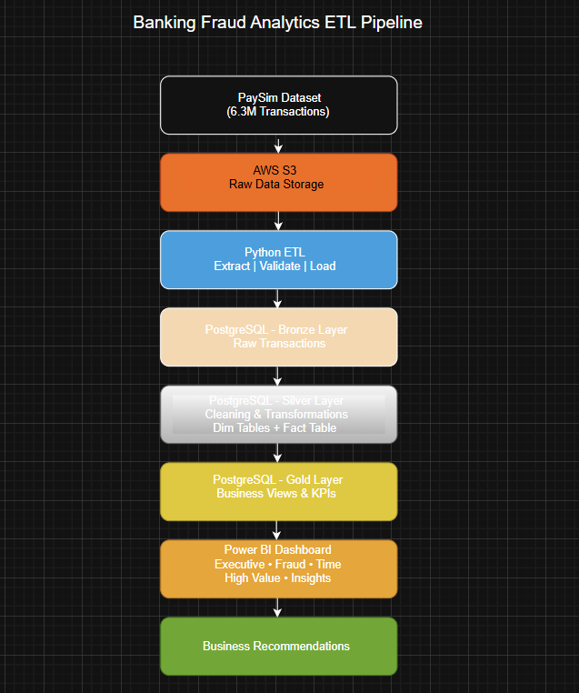
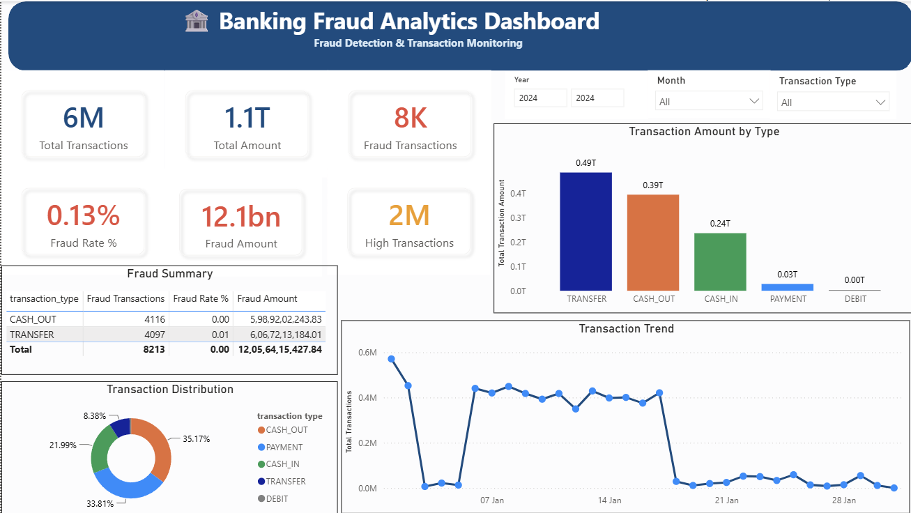
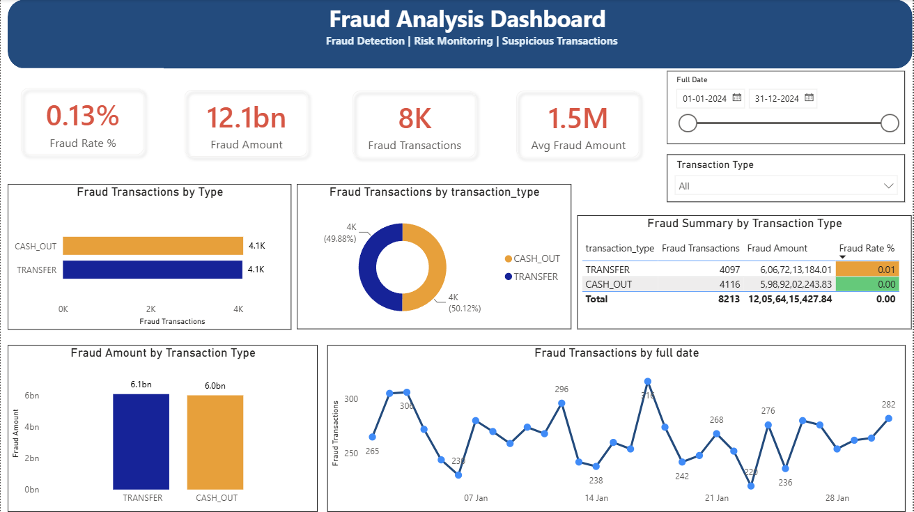
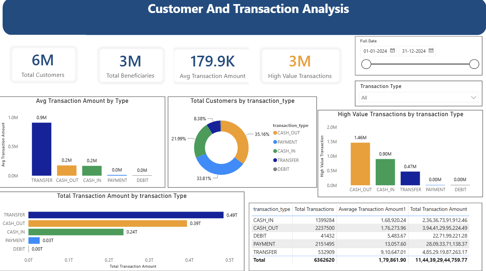
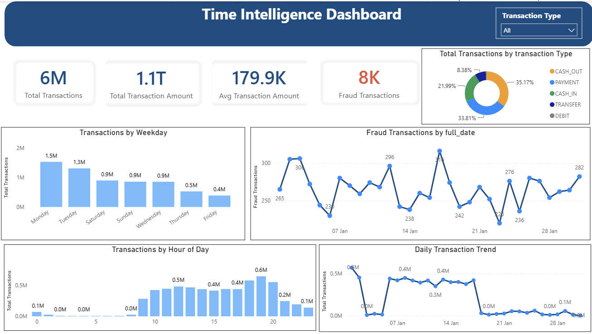
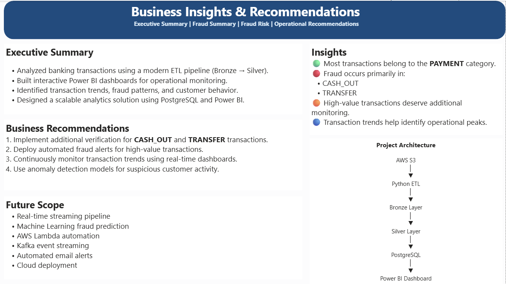

<p align="center">

# 🏦 Banking Fraud Analytics

### End-to-End ETL Pipeline | AWS S3 | Python | PostgreSQL | Power BI

</p>

<p align="center">


</p>


## 📌 Project Overview

This project demonstrates a complete end-to-end Banking Fraud Analytics solution built using a modern ETL architecture. The objective is to ingest raw banking transaction data, transform it into business-ready datasets, store it in a PostgreSQL data warehouse, and build an interactive Power BI dashboard for fraud monitoring and business insights.

The project follows the **Bronze → Silver → Gold** data architecture commonly used in modern data engineering and analytics platforms.

---
# ⭐ Project Highlights

- Processed **6.3+ Million Banking Transactions**
- Built an End-to-End **Bronze → Silver → Gold ETL Pipeline**
- Developed an automated ETL workflow using **Python**
- Stored and transformed data using **PostgreSQL**
- Designed a **Star Schema** data model
- Created **5 Interactive Power BI Dashboard Pages**
- Generated Business Insights and Fraud Monitoring KPIs
- Implemented Logging and Data Validation

# 📑 Table of Contents

- Project Overview
- Business Problem
- Project Highlights
- Project Architecture
- Technology Stack
- Project Workflow
- ETL Pipeline
- Database Design
- Power BI Dashboard
- Dashboard Screenshots
- Business Insights
- Business Recommendations
- Project Structure
- Installation Guide
- Future Improvements
- Author

# 🎯 Business Problem

Financial institutions process millions of transactions every day, making fraud detection a critical business challenge.

The goal of this project is to:

- Monitor transaction activity
- Identify fraudulent transactions
- Analyze customer transaction behavior
- Build business-ready datasets
- Generate actionable business recommendations
- Visualize KPIs using Power BI

---

# 🏗 Project Architecture



---

# ⚙ Tech Stack

| Technology | Purpose |
|------------|----------|
| Python | ETL Pipeline |
| Pandas | Data Processing |
| AWS S3 | Raw Data Storage |
| PostgreSQL | Data Warehouse |
| SQL | Data Analysis |
| Power BI | Dashboard & Visualization |
| Git & GitHub | Version Control |

---

# 📂 Project Workflow

```text
PaySim Dataset
        │
        ▼
AWS S3
        │
        ▼
Python ETL Pipeline
(Extract → Validate → Transform → Load)
        │
        ▼
Bronze Layer
(Raw Data)
        │
        ▼
Silver Layer
(Cleaned Business Data)
        │
        ▼
Gold Layer
(Business Views)
        │
        ▼
Power BI Dashboard
        │
        ▼
Business Insights & Recommendations
```

---

# 🛠 ETL Pipeline

## Bronze Layer

The Bronze Layer stores raw transaction data exactly as received from the source without any business transformations.

### Tasks Performed

- Data Extraction
- Data Validation
- Data Loading
- Logging
- Raw Data Preservation

---

## Silver Layer

The Silver Layer converts raw data into business-ready datasets.

### Transformations

- Column Renaming
- Data Type Conversion
- Boolean Conversion
- Timestamp Creation
- Transaction Type Lookup
- Dimension Table Integration
- Fact Table Creation

---

## Gold Layer

The Gold Layer contains business-ready SQL views optimized for reporting.

Examples:

- Daily Fraud Trend
- Hourly Fraud Analysis
- High Value Transactions
- Transaction Summary

---

# 🗄 Database Design

## Fact Table

### silver.fact_transactions

Contains:

- Transaction ID
- Transaction Type
- Amount
- Customer Information
- Fraud Flag
- Transaction Timestamp

---

## Dimension Tables

### silver.dim_date

- Date
- Year
- Month
- Quarter
- Day Name

### silver.dim_transaction_type

- Transaction Type ID
- Transaction Type

---

# 📊 Power BI Dashboard

The dashboard consists of **5 interactive pages**.

---

## 1️⃣ Executive Overview

### KPIs

- Total Transactions
- Total Transaction Amount
- Fraud Transactions
- Fraud Amount
- Fraud Rate

### Visuals

- Daily Transaction Trend
- Transaction Distribution
- Fraud Overview

---

## 2️⃣ Fraud Analysis

### Analysis Includes

- Fraud by Transaction Type
- Fraud Amount
- Fraud Rate
- Fraud Summary Table
- High Risk Transaction Types

---

## 3️⃣ Customer & Transaction Analysis

### Insights

- High Value Transactions
- Transaction Type Distribution
- Customer Transaction Behavior
- Top Transaction Categories

---

## 4️⃣ Time Intelligence Dashboard

### Analysis

- Daily Transaction Trend
- Transactions by Hour
- Transactions by Weekday
- Fraud Trend Over Time

---

## 5️⃣ Business Insights & Recommendations

Includes

- Executive Summary
- Key Business Findings
- Business Recommendations
- Future Enhancements

---

# 📸 Dashboard Screenshots

## Executive Overview



---

## Fraud Analysis



---

## Customer & Transaction Analysis



---

## Time Intelligence



---

## Business Recommendations



---

# 📈 Key Business Insights

- Processed over **6.3 million banking transactions**.
- Fraud represents a very small percentage of total transactions but has significant financial impact.
- CASH_OUT and TRANSFER transactions contribute the highest fraud volume.
- Transaction activity varies significantly throughout the day.
- High-value transactions require additional monitoring.

---

# 💡 Business Recommendations

- Implement real-time fraud alerts for high-value transactions.
- Apply stricter verification for CASH_OUT and TRANSFER operations.
- Monitor peak transaction hours with enhanced fraud detection.
- Deploy machine learning models for anomaly detection.
- Continuously monitor fraud trends through Power BI dashboards.

---

# 📁 Project Structure

```text
Banking-Fraud-Analytics
│
├── data/
│
├── docs/
│   ├── architecture.png
│   └── screenshots/
│
├── python/
│   ├── extract.py
│   ├── validate.py
│   ├── transform.py
│   ├── load.py
│   ├── silver_etl.py
│   ├── logger.py
│   └── config/
│
├── sql/
│
├── powerbi/
│   └── Banking_Fraud_Analytics.pbix
│
├── requirements.txt
│
└── README.md
```

---

# 🚀 How to Run the Project

## Clone Repository

```bash
git clone https://github.com/AkhileshDesai19/Banking-Fraud-Analytics.git
```

## Install Dependencies

```bash
pip install -r requirements.txt
```

## Configure PostgreSQL

Update the PostgreSQL credentials in:

```text
python/config/config.ini
```

---

## Run Bronze ETL

```bash
python python/main.py
```

---

## Run Silver ETL

```bash
python python/silver_etl.py
```

---

## Open Power BI

Open:

```text
Banking_Fraud_Analytics.pbix
```

Click **Refresh** to load the latest data.

---

# 🔮 Future Enhancements

- Real-time streaming with Apache Kafka
- Machine Learning fraud prediction
- Automated ETL scheduling with Apache Airflow
- AWS Lambda integration
- Snowflake Data Warehouse
- Interactive web dashboard using Streamlit

---

# 👨‍💻 Author

**Akhilesh Desai**

- 💼 Aspiring Data Analyst
- 🐍 Python | SQL | PostgreSQL | Power BI | AWS
- 🔗 LinkedIn: https://www.linkedin.com/in/akhileshdesai19
- 💻 GitHub: https://github.com/AkhileshDesai19

---

## ⭐ If you found this project useful, consider giving it a star!
