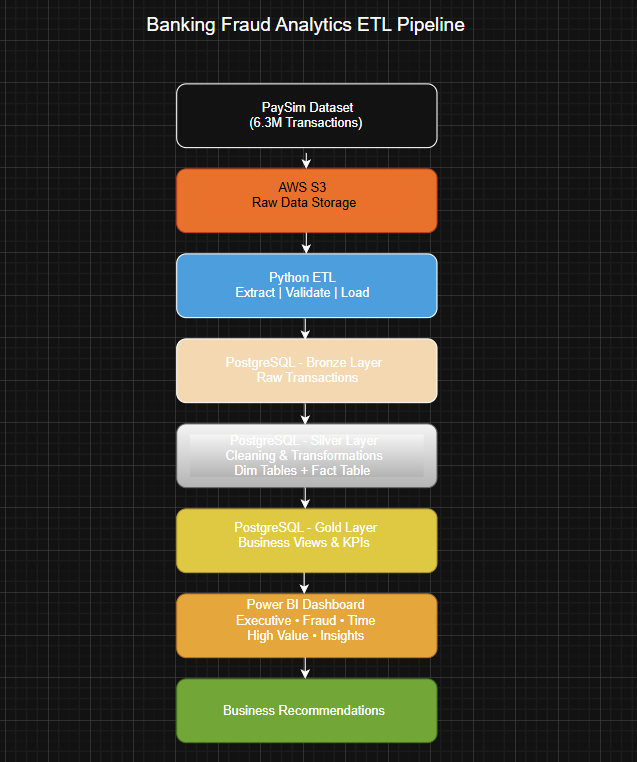
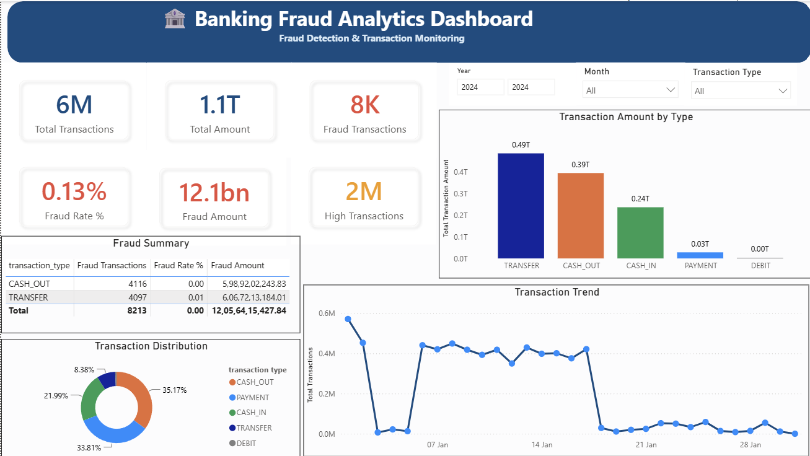
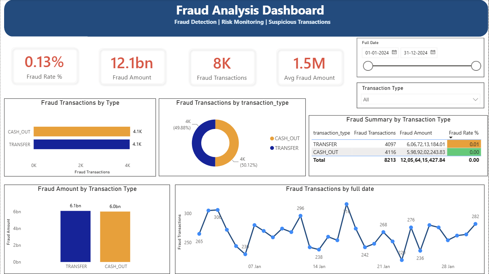
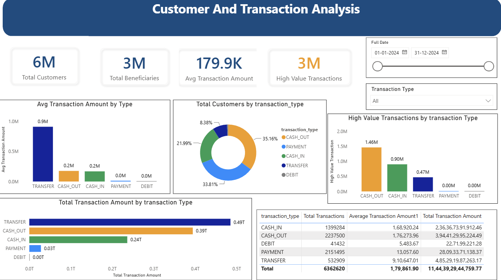
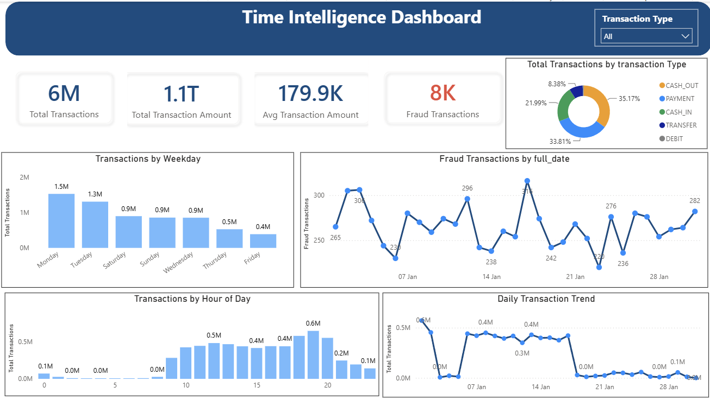
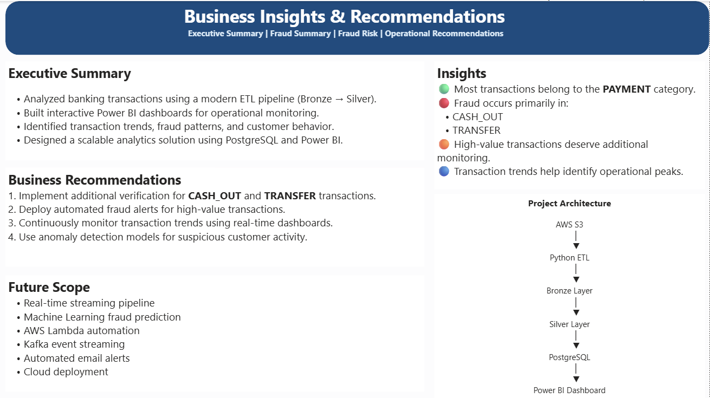

<p align="center">

# 🏦 Banking Fraud Analytics

### Fraud Analytics & Business Intelligence | Python | SQL | PostgreSQL | Power BI | AWS

</p>

<p align="center">


</p>

---

## 📌 Project Overview

**Banking Fraud Analytics** is an end-to-end data analytics project focused on analyzing millions of banking transactions to identify fraud patterns, high-risk transaction behavior, and key business KPIs.

The project uses **Python and Pandas for data preparation and ETL, PostgreSQL and SQL for analytical processing, and Power BI for interactive reporting and business insights**.

AWS S3 is used as the raw data storage layer, while a **Bronze → Silver → Gold** architecture organizes the data from raw transactions to business-ready analytical datasets.

The primary objective is to transform raw transaction data into reliable, analysis-ready data and use it to support **fraud monitoring and data-driven business decisions**.

---

# ⭐ Project Highlights

* Analyzed **6.3+ million banking transactions**
* Built a structured **Python ETL workflow** for data extraction, validation, transformation, and loading
* Used **AWS S3** for raw transaction data storage
* Organized data using a **Bronze → Silver → Gold** architecture
* Used **PostgreSQL and SQL** for transaction and fraud analysis
* Designed a **Star Schema** for analytical reporting
* Calculated fraud, transaction, and financial KPIs
* Built **5 interactive Power BI dashboard pages**
* Performed transaction, fraud, customer, and time-based analysis
* Implemented **data validation and logging** during the ETL process
* Generated actionable **business insights and recommendations**

---

# 📑 Table of Contents

* [Project Overview](#-project-overview)
* [Business Problem](#-business-problem)
* [Analytical Objectives](#-analytical-objectives)
* [Project Highlights](#-project-highlights)
* [Project Architecture](#-project-architecture)
* [Technology Stack](#-technology-stack)
* [Project Workflow](#-project-workflow)
* [Data Preparation & ETL](#-data-preparation--etl)
* [Database Design](#-database-design)
* [SQL Analysis](#-sql-analysis)
* [Power BI Dashboard](#-power-bi-dashboard)
* [Dashboard Screenshots](#-dashboard-screenshots)
* [Key Business Insights](#-key-business-insights)
* [Business Recommendations](#-business-recommendations)
* [Project Structure](#-project-structure)
* [How to Run the Project](#-how-to-run-the-project)
* [Future Enhancements](#-future-enhancements)
* [Author](#-author)

---

# 🎯 Business Problem

Financial institutions process millions of transactions, making fraud monitoring an important business and operational challenge.

The project focuses on using transaction data to answer questions such as:

* How frequently does fraud occur?
* Which transaction types have the highest fraud activity?
* What is the financial impact of fraudulent transactions?
* How does transaction activity vary over time?
* Which transactions require additional monitoring?
* What patterns can help financial institutions improve fraud monitoring?

The goal is to convert raw transaction data into **actionable analytical insights** that can support fraud monitoring and business decision-making.

---

# 📊 Analytical Objectives

The analysis focuses on:

* Measuring overall transaction activity
* Calculating fraud transaction volume and fraud rate
* Analyzing fraudulent transactions by transaction type
* Identifying high-value and potentially high-risk transactions
* Understanding transaction behavior across time
* Analyzing customer transaction behavior
* Monitoring fraud trends through interactive dashboards
* Providing recommendations based on observed transaction patterns

---

# 🏗 Project Architecture



The project follows a structured analytics workflow:

```text
Raw PaySim Transaction Data
            │
            ▼
        AWS S3
     Raw Data Storage
            │
            ▼
      Python / Pandas
   Data Preparation & ETL
            │
            ▼
       Bronze Layer
        Raw Data
            │
            ▼
       Silver Layer
   Cleaned Analytical Data
            │
            ▼
        Gold Layer
    Business-Ready Views
            │
            ▼
       PostgreSQL
            │
            ▼
       SQL Analysis
            │
            ▼
        Power BI
    Interactive Dashboards
            │
            ▼
   Business Insights &
     Recommendations
```

---

# ⚙ Technology Stack

| Technology   | Purpose                           |
| ------------ | --------------------------------- |
| Python       | Data Preparation & ETL            |
| Pandas       | Data Cleaning & Transformation    |
| AWS S3       | Raw Data Storage                  |
| PostgreSQL   | Analytical Database               |
| SQL          | Data Analysis & KPI Calculation   |
| Power BI     | Dashboard & Business Intelligence |
| DAX          | Power BI Measures & Analysis      |
| Git & GitHub | Version Control                   |

---

# 🔄 Project Workflow

The project follows an end-to-end analytics workflow:

### 1. Data Ingestion

Raw PaySim transaction data is stored in **AWS S3**.

### 2. Data Preparation

Python and Pandas are used to:

* Extract transaction data
* Validate incoming data
* Clean and transform fields
* Convert data types
* Create timestamps
* Prepare analytical datasets

### 3. Data Organization

The processed data is organized into:

* **Bronze Layer** — raw transaction data
* **Silver Layer** — cleaned and structured analytical data
* **Gold Layer** — business-ready SQL views

### 4. SQL Analysis

PostgreSQL and SQL are used to analyze:

* Transaction activity
* Fraud transactions
* Fraud rates
* Transaction types
* High-value transactions
* Time-based patterns
* Customer transaction behavior

### 5. Business Intelligence

Power BI is used to transform the analytical results into interactive dashboards.

### 6. Insights & Recommendations

The final analysis is used to identify important fraud patterns and provide business recommendations.

---

# 🛠 Data Preparation & ETL

## Bronze Layer

The Bronze Layer preserves the raw transaction data before business transformations.

### Tasks

* Data extraction
* Data validation
* Raw data loading
* Logging
* Raw data preservation

---

## Silver Layer

The Silver Layer contains cleaned and structured analytical data.

### Transformations

* Column renaming
* Data type conversion
* Boolean conversion
* Timestamp creation
* Transaction type lookup
* Dimension table integration
* Fact table creation

---

## Gold Layer

The Gold Layer contains business-ready SQL views used for reporting and analysis.

Examples include:

* Daily Fraud Trend
* Hourly Fraud Analysis
* High Value Transactions
* Transaction Summary

---

# 🗄 Database Design

The analytical database uses a structured model consisting of a transaction fact table and supporting dimensions.

## Fact Table

### `silver.fact_transactions`

Contains:

* Transaction ID
* Transaction Type
* Amount
* Customer Information
* Fraud Flag
* Transaction Timestamp

---

## Dimension Tables

### `silver.dim_date`

Contains:

* Date
* Year
* Month
* Quarter
* Day Name

### `silver.dim_transaction_type`

Contains:

* Transaction Type ID
* Transaction Type

This structure supports efficient SQL analysis and Power BI reporting.

---

# 🔎 SQL Analysis

PostgreSQL and SQL are used to answer business questions related to transaction activity and fraud.

The analysis includes:

* Transaction volume analysis
* Fraud transaction analysis
* Fraud rate calculation
* Fraud amount analysis
* Transaction type comparison
* High-value transaction analysis
* Time-based transaction analysis
* Customer transaction behavior

The SQL analysis produces business-ready datasets and views that are used for Power BI reporting.

---

# 📊 Power BI Dashboard

The Power BI solution contains **5 interactive pages** designed for fraud monitoring and business analysis.

---

## 1️⃣ Executive Overview

### KPIs

* Total Transactions
* Total Transaction Amount
* Fraud Transactions
* Fraud Amount
* Fraud Rate

### Analysis

* Daily Transaction Trend
* Transaction Distribution
* Overall Fraud Overview

---

## 2️⃣ Fraud Analysis

### Analysis Includes

* Fraud by Transaction Type
* Fraud Amount
* Fraud Rate
* Fraud Summary
* High-Risk Transaction Types

---

## 3️⃣ Customer & Transaction Analysis

### Analysis Includes

* High-Value Transactions
* Transaction Type Distribution
* Customer Transaction Behavior
* Top Transaction Categories

---

## 4️⃣ Time Intelligence

### Analysis Includes

* Daily Transaction Trend
* Transactions by Hour
* Transactions by Weekday
* Fraud Trend Over Time

---

## 5️⃣ Business Insights & Recommendations

The final dashboard page summarizes:

* Key analytical findings
* Important fraud patterns
* Business implications
* Recommended actions
* Future analytical opportunities

---

# 📸 Dashboard Screenshots

## Executive Overview



---

## Fraud Analysis



---

## Customer & Transaction Analysis



---

## Time Intelligence



---

## Business Recommendations



---

# 📈 Key Business Insights

* Processed over **6.3 million banking transactions**.
* Fraud represents a small percentage of total transactions but has a significant financial impact.
* **CASH_OUT** and **TRANSFER** transactions contribute the highest fraud volume.
* Transaction activity varies across different times of the day.
* High-value transactions require additional monitoring.
* Fraud trends can be monitored through interactive Power BI reporting.

---

# 💡 Business Recommendations

Based on the analysis:

* Implement additional monitoring for high-value transactions.
* Apply stricter verification for **CASH_OUT** and **TRANSFER** operations.
* Monitor peak transaction periods for unusual activity.
* Use interactive Power BI reporting for continuous fraud monitoring.
* Explore machine learning-based anomaly detection as a future enhancement.

---

# 📁 Project Structure

```text
Banking-Fraud-Analytics
│
├── data/
│
├── docs/
│   ├── architecture.png
│   └── screenshots/
│
├── python/
│   ├── extract.py
│   ├── validate.py
│   ├── transform.py
│   ├── load.py
│   ├── silver_etl.py
│   ├── logger.py
│   └── config/
│
├── sql/
│
├── powerbi/
│   └── Banking_Fraud_Analytics.pbix
│
├── requirements.txt
│
└── README.md
```

---

# 🚀 How to Run the Project

## 1. Clone Repository

```bash
git clone https://github.com/AkhileshDesai19/Banking-Fraud-Analytics.git
```

## 2. Install Dependencies

```bash
pip install -r requirements.txt
```

## 3. Configure PostgreSQL

Update the PostgreSQL credentials in:

```text
python/config/config.ini
```

## 4. Run Bronze ETL

```bash
python python/main.py
```

## 5. Run Silver ETL

```bash
python python/silver_etl.py
```

## 6. Open Power BI

Open:

```text
Banking_Fraud_Analytics.pbix
```

Click **Refresh** to load the latest analytical data.

---

# 🔮 Future Enhancements

Potential future improvements include:

* Real-time fraud monitoring using Apache Kafka
* Machine learning-based fraud prediction
* Automated ETL scheduling with Apache Airflow
* AWS Lambda integration
* Snowflake data warehouse integration
* Interactive web analytics using Streamlit

---

# 👨‍💻 Author

**Akhilesh Desai**

**Data Analyst | SQL | Python | PostgreSQL | Power BI | AWS**

🔗 LinkedIn: https://www.linkedin.com/in/akhileshdesai19

💻 GitHub: https://github.com/AkhileshDesai19

---

## ⭐ If you found this project useful, consider giving it a star!
